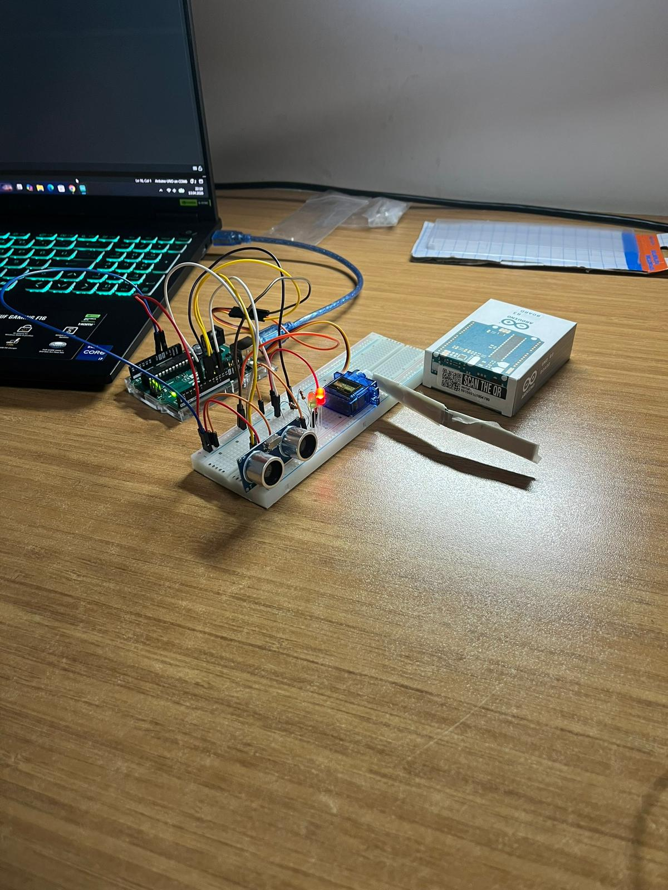
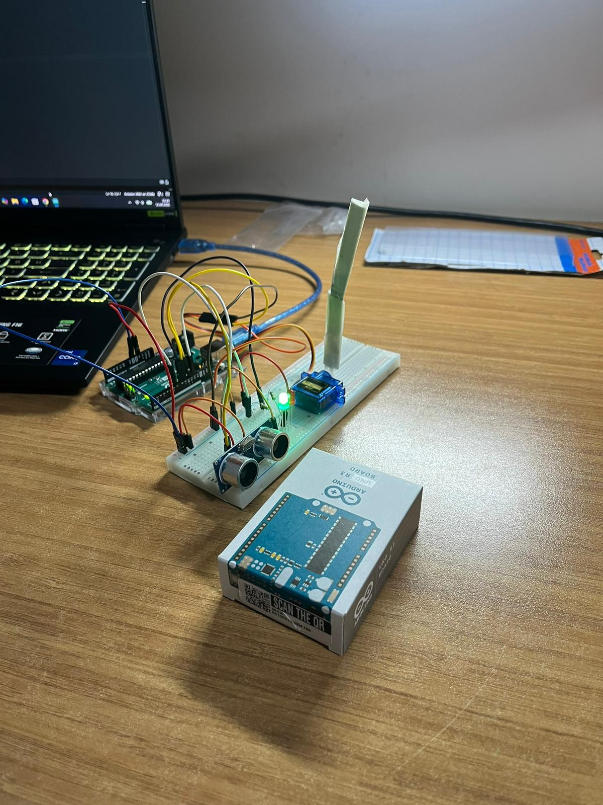

# 🚗 Akıllı Otopark Bariyer Sistemi

Bu proje, HC-SR04 ultrasonik mesafe sensörü kullanarak yaklaşan araçları algılayan ve servo motor ile bariyeri otomatik olarak açıp kapatan bir Arduino projesidir. Sistem, durum takibi için Kırmızı ve Yeşil LED'ler ile görsel geri bildirim sağlamaktadır.

## 📌 Pin Bağlantı Tablosu

Koda uygun olarak yapılması gereken devre bağlantıları aşağıdadır:

| Komponent | Arduino Pini | Görev / Açıklama |
| :--- | :---: | :--- |
| **HC-SR04 Trig** | `D11` | Ses dalgası gönderici (Çıkış) |
| **HC-SR04 Echo** | `D12` | Yankı algılayıcı (Giriş) |
| **Servo Motor** | `D9` | Bariyer kontrolü |
| **Kırmızı LED** | `D8` | Bariyer kapalı / "Bekle" uyarısı |
| **Yeşil LED** | `D7` | Bariyer açık / "Geçebilirsin" uyarısı |

## ⚙️ Çalışma Mantığı

1. **Bekleme Durumu:** Sistem ilk açıldığında veya ortamda araç yokken bariyer kapalı (90°) konumdadır ve **Kırmızı LED** yanar.
2. **Algılama ve Açılma:** Sensör 10 cm'den daha yakın bir engel (araç) algıladığında:
   * Kırmızı LED söner, **Yeşil LED** yanar.
   * Servo motor çalışarak bariyeri açık (0°) konumuna getirir.
   * Aracın güvenle geçebilmesi için sistem 3 saniye (`delay(3000)`) bekler.
3. **Kapanma:** Araç uzaklaştığında (mesafe 10 cm'nin üzerine çıktığında) sistem tekrar bekleme durumuna döner, bariyer kapanır ve kırmızı LED yanar.
4. **Hata Ayıklama:** Anlık mesafe ölçümleri 9600 baud rate hızında Arduino IDE **Seri Port Ekranı** üzerinden milisaniye bazında takip edilebilir.

## 📸 Proje Uygulaması

Projenin fiziksel kurulumuna ve çalışma anına ait görseller:

| Kapı Kapalı (Araç Bekleniyor) | Kapı Açık (Araç Geçiyor) |
| :---: | :---: |
|  |  |

## 🚀 Kurulum ve Kullanım

1. Devre bağlantılarını yukarıdaki pin tablosuna göre Arduino kartınıza yapın.
2. `Otomatik_kapi.ino` dosyasını Arduino IDE ile açın.
3. Araçlar (Tools) menüsünden doğru kartı ve portu seçin.
4. Kodu yükleyin ve sistemin çalışmasını test edin.
5. *(Opsiyonel)* Sistemin mesafeyi nasıl algıladığını görmek için `Ctrl + Shift + M` kısayolu ile Seri Port Ekranını açın.

---
[🏠 Ana Sayfaya Dön](../README.md)
