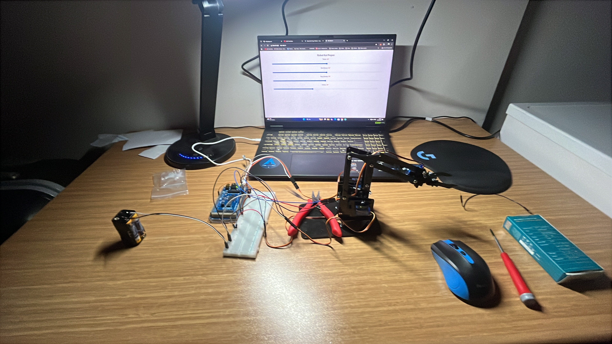

# 🤖 Rex Discovery Web Kontrollü Robot Kol

Bu proje, [Robotistan Rex Discovery Serisi Pleksi Robot Kol](https://akademi.robotistan.com/rex-discovery-serisi-pleksi-robot-kol-arduino-uyumlu/) şasesi kullanılarak geliştirilmiş, çok eksenli (4-DOF) bir robotik koldur. Projenin temel amacı, servo motorların Wi-Fi üzerinden sunulan web tabanlı bir arayüz aracılığıyla anlık açılarla (slider) senkronize ve yumuşak bir şekilde kontrol edilmesini sağlamaktır.

## 📸 Proje Görünümü

Aşağıdaki görselde projenin tamamlanmış fiziksel kurulumunu ve arka planda motor açılarını kontrol eden web arayüzünü görebilirsiniz:

## 📌 Pin Bağlantı Tablosu

Projenin doğru çalışması için servo motorların sinyal (PWM) kablolarını aşağıdaki pinlere bağlamalısınız:

| Servo Motor | Kart Pini | Hareket Ekseni |
| :--- | :---: | :--- |
| **Taban (Base)** | `9` | Sağ-Sol Dönüş |
| **Sol (Omuz)** | `10` | İleri-Geri Uzanma |
| **Sağ (Dirsek)** | `11` | Dikey Yükselme / Alçalma |
| **Kıskaç (Gripper)**| `12` | Nesne Tutma / Bırakma |

> **⚠️ Önemli Güvenlik Notu:** Kod içerisinde kıskaç (gripper) motorunun fiziksel olarak zorlanıp yanmaması için yazılımsal bir sınırlandırıcı bulunmaktadır. Kıskaç sadece **40° ile 130°** arasında hareket edebilir.

## 🌐 Ağ ve Bağlantı Bilgileri

Robot kol kontrolcü kartı, kendi Wi-Fi ağını (Erişim Noktası / Access Point) oluşturur. Sistemi kontrol etmek için aşağıdaki ağa katılmalısınız:

* **Ağ Adı (SSID):** `Robotkol_yonetim`
* **Şifre:** `12345678`

Ağa bağlandıktan sonra Arduino IDE **Seri Port Ekranını (115200 baud rate)** açarak cihazın aldığı IP adresini öğrenebilir ve bu IP adresini web tarayıcınıza yazarak kontrol paneline ulaşabilirsiniz.

## 🛠️ Kullanılan Donanımlar

* **Mekanik İskelet:** Rex Discovery Serisi Pleksi Robot Kol
* **Kontrolcü Kart:** Wi-Fi Destekli Geliştirme Kartı Arduino Giga
* **Eyleyiciler:** 4 Adet Servo Motor 
* **Güç Kaynağı:** Harici Pil Kutusu (Servo motorların anlık akım çekimlerinde kartı resetlememesi ve stabil çalışması için harici besleme kullanılmıştır.)
* **Diğer:** Breadboard ve Jumper Kablolar

## ⚙️ Çalışma Mantığı ve Yazılımsal Özellikler

1. **Web Tabanlı Kontrol:** Bilgisayar veya telefon ekranında görülen arayüz üzerinden her bir eksen için birer kaydırıcı (slider) bulunur.
2. **Yumuşak Hareket Algoritması (Non-blocking):** Gelen açı değerleri motora aniden yollanmaz. `millis()` fonksiyonu kullanılarak motorların hedef açıya adım adım (ms bazında gecikmeyle) yumuşak bir şekilde gitmesi sağlanır. Bu sayede mekanik sarsıntılar önlenir.
3. **Anlık İletişim:** Arayüzdeki slider'lar hareket ettirildiğinde, belirlenen açı değeri anlık olarak HTTP GET istekleriyle mikrokontrolcüye iletilir.
4. **Harici Besleme:** Servo motorların kararlı çalışabilmesi için motorların `VCC` ve `GND` hatları geliştirme kartından değil, doğrudan harici güç kaynağından beslenmektedir (Sadece ortak GND bağlantısı yapılmıştır).

## 🚀 Kurulum Adımları

1. Robot kolun pleksi montajını gerçekleştirin ve servo motorları yerlerine sabitleyin.
2. `robotkol.ino` dosyasını Arduino IDE üzerinden açın ve `<WiFi.h>` ile `<Servo.h>` kütüphanelerinin kurulu olduğundan emin olun.
3. Kontrolcü kartınıza uygun port seçimini yapıp kodu yükleyin.
4. Motorların bağlantılarını yukarıdaki pin tablosuna göre yapın. Harici güç kaynağı kullanmayı ve **GND hatlarını birleştirmeyi** unutmayın.
5. Bilgisayarınızdan veya telefonunuzdan `Robotkol_yonetim` Wi-Fi ağına bağlanıp tarayıcı üzerinden sistemi test edin.

---
[🏠 Ana Sayfaya Dön](../README.md)
